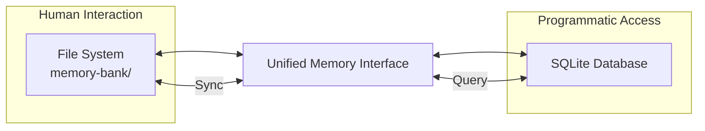

# Windsurf Unified Memory System

## Version: 1.0.0 (Last updated: 2025-05-25)

This document explains the architecture and usage of the Unified Memory System in the Windsurf Project.

## Table of Contents

- [Overview](#overview)
- [Architecture](#architecture)
- [Getting Started](#getting-started)
- [Using the Memory System](#using-the-memory-system)
- [Agent Integration](#agent-integration)
- [Troubleshooting](#troubleshooting)

## Overview

**Session Management:**

- For the complete Session Start Protocol, see [`rules/session_management.rules.md`](../rules/session_management.rules.md).
- For automation and agent reference, see [`tools/session_start_protocol.md`](../tools/session_start_protocol.md).

The Unified Memory System provides a robust, dual-layer storage solution that combines:

- **File-based Storage**: Human-readable markdown files in the `memory-bank/` directory
- **SQLite Database**: High-performance structured storage for programmatic access
- **Unified Interface**: A single API that abstracts both storage layers

## Architecture

### Components

1. **File-based Layer** (`memory-bank/`)
   - Human-editable markdown files
   - Version control friendly
   - Direct access for manual editing

2. **SQLite Database** (`windsurf_memory.db`)
   - High-performance structured storage
   - Advanced querying capabilities
   - Automatic indexing

3. **Unified Interface** (`tools/unified_memory.py`)
   - Single API for all memory operations
   - Handles synchronization between layers
   - Provides consistent access patterns

### Data Flow



## Getting Started

### Prerequisites

- Python 3.8+
- Dependencies installed from `requirements.txt`

### Initial Setup

1. The system initializes automatically on first use
2. The SQLite database is created at `memory-bank/windsurf_memory.db`
3. The `memory-bank/` directory is created if it doesn't exist

## Using the Memory System

### For Humans

1. **Edit files directly** in the `memory-bank/` directory
2. Use any markdown editor
3. Changes are automatically synced to the database

### For Agents

```python
from tools.agent_interface import AgentMemoryInterface

# Initialize an agent
agent = AgentMemoryInterface(
    agent_id="your_agent_id",
    agent_type="your_agent_type"
)

# Log activities
agent.log_activity("task_started", {"task": "Process data"})


# Share knowledge
knowledge = agent.share_knowledge(
    content="Important project information",
    tags=["documentation", "api"]
)

# Search for information
results = agent.search_knowledge("search query")
```

### Command Line Interface

```bash
# Start the interactive CLI
python tools/memory_cli.py

# Or run specific commands
python tools/memory_cli.py search "query"
python tools/memory_cli.py list agents
```

## Agent Integration

### Best Practices

1. **Agent IDs**: Use consistent naming (e.g., `team1_coder`)

2. **Activity Logging**: Log important actions

3. **Knowledge Sharing**: Use descriptive tags

4. **Error Handling**: Always include error handling

### Example Workflow

1. Agent initializes with unique ID
2. Logs activities during operation
3. Shares knowledge with the team
4. Searches for existing information
5. Updates knowledge as needed

## Troubleshooting

### Common Issues

1. **Database Locked**: Ensure no other process is using the database
2. **Sync Issues**: Run manual sync if automatic sync fails
3. **Permission Errors**: Check file permissions in `memory-bank/`

### Manual Maintenance

```bash
# Rebuild database from files
python tools/sync_memory.py --rebuild

# Check database integrity
python tools/sync_memory.py --check
```

## Advanced Topics

### Custom Entity Types

1. Create a new markdown template in `memory-bank/_templates/`
2. Define required fields in the front matter
3. The system will automatically handle the new type

### Performance Tuning

- **Large Files**: Consider splitting large documents
- **Frequent Updates**: Batch operations when possible
- **Query Optimization**: Use specific tags and metadata

## Support

For issues not covered in this document, please:

1. Check the logs in `logs/`
2. Review existing issues
3. Open a new issue with detailed information
